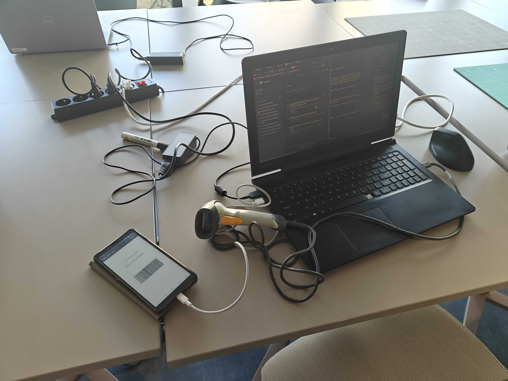

# MAC Address Barcode Generator

Android application to display a barcode of the connected host computer's MAC address. For use with E-ink display phones in case an LCD screen is incompatible with the scanner.



## Overview

This project uses the host computer to determine its own MAC address and pass it to the Android application when it's launched via the Android Debug Bridge (ADB). The app has been programmed to accept a `MAC_ADDRESS` string from the launch command's "intent extras".

## How to Use

1.  **Build and Install the App**

    Make sure your Android device is connected and has USB debugging enabled. Then, run the following command in your terminal to build and install the application:

    ```powershell
    .\gradlew installDebug
    ```

2.  **Run the Launcher Script**

    To get your computer's MAC address and launch the app with it, use the following PowerShell command:

    ```powershell
    $laptopMac = (Get-NetAdapter | Where-Object Status -eq "Up" | Select-Object -First 1).MacAddress.Replace("-", ":"); adb shell am start -S -n com.example.macqrcode/.MainActivity -e "MAC_ADDRESS" "$laptopMac"
    ```

    This command does the following:
    -   `Get-NetAdapter | ...`: Finds the first active network adapter on your Windows machine.
    -   `.MacAddress.Replace("-", ":")`: Gets its MAC address and formats it with colons.
    -   `adb shell am start ...`: Starts the application on your device, passing the MAC address as an extra string variable named `MAC_ADDRESS`.

The app will launch, and you will see the barcode for your computer's MAC address.
